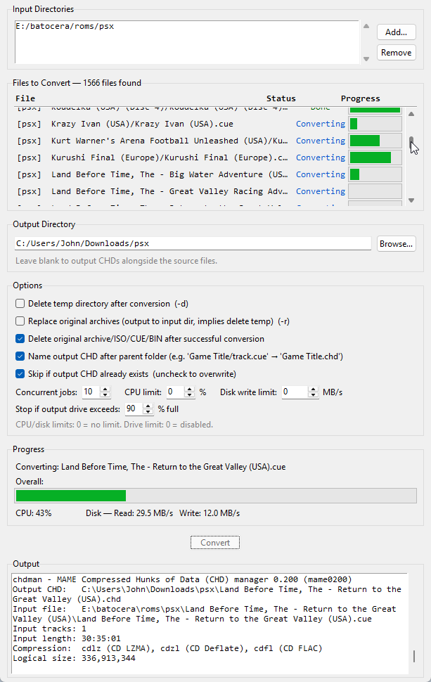

# CHDconvert

Converts a directory of archives (`.gz`, `.7z`, `.zip`) or loose disc images (`.iso`, `.cue`, `.bin`) into `.chd` files, for use with console emulators. Includes both a command-line script and a GUI application.

---

# Requirements

- [`Python`](https://www.python.org/downloads/)
- [`Git`](https://git-scm.com/download/win) (for cloning)
- `chdman` — included on Windows (`chdman.exe`). On Linux/Mac, install via your package manager (see below).

Optional (for `.7z` support):
```
pip install py7zr
```

---

# Installation

### Method A: Clone

```
git clone https://github.com/nickheyer/CHDconvert
cd C:\Where\you\cloned\this\repo
pip install -r requirements.txt
```

### Method B: Download Release

Download and unzip from:
```
https://github.com/uqKami/CHDconvert/releases/latest
```
Then:
```
cd C:\Where\you\unzipped\the\release
pip install -r requirements.txt
```

---

# Linux / Mac

Install `chdman` via your package manager:
```
sudo apt install mame-tools       # Debian/Ubuntu
sudo pacman -S mame-tools         # Arch
brew install rom-tools            # macOS
```

---

# GUI Usage



Launch the graphical interface:
```
python chdconvert_gui.py
```

### What it does

- Add one or more input directories using the **Add…** button
- The file list auto-populates with all convertible files found — archives and loose ISO/CUE/BIN files in the selected directories and all subdirectories
- Choose your options, then click **Convert**

### Options

| Option | Description |
|---|---|
| Delete temp directory after conversion | Removes the `_tmp` extraction folder when done |
| Replace original archives | Deletes originals and outputs CHDs into the same input directory (implies delete temp) |
| Delete original archive/ISO/CUE/BIN after successful conversion | Removes the source file once the CHD has been created successfully |
| Name output CHD after parent folder | Names the CHD after the containing subfolder instead of the filename — e.g. `Sonic The Hedgehog (USA)/track01.cue` → `Sonic The Hedgehog (USA).chd` |

### Output

By default CHDs are written to a sibling folder named `<input dir>_out`. With **Replace original archives** enabled, they are written back into the input directory.

---

# CLI Usage

```
python chdconvert.py [path] [--delete | --replace]
```

| Argument | Description |
|---|---|
| *(none)* | Prompts for a folder path |
| `path` | Folder containing archives to convert |
| `--delete` / `-d` | Delete the `_tmp` extraction folder after conversion |
| `--replace` / `-r` | Delete the original archive and output the CHD back into the input directory |

Output goes to `<folder>_out` by default, or back into the input folder with `--replace`.

---

# Shoutouts

Thanks CHDMAN!
